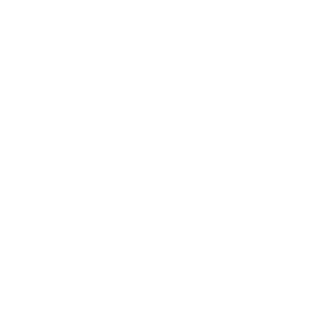

# Welcome to UMS COPY _better than original one_ 😁👌
## References
- [Welcome to UMS COPY _better than original one_ 😁👌](#welcome-to-ums-copy-better-than-original-one-)
  - [References](#references)
- [Project links](#project-links)
- [What I learned](#what-i-learned)
- [Cards Icon](#cards-icon)


# Project links

*  
   * [Live Link](https://mohameda122ouz.github.io/ums)
   * [repository](https://www.github.com/mohameda122ouz/ums)

# What I learned
Don't nest to much as it will become harder to you to fix any thing in html when the nested elements is so specific
```scss
.selector1{
    .selector2{
        .selector3{
            color:purple;
        }
    }
}
```
this code will work if we have html like this
```html
<div class="selecor1">
    <div class="selecor2">
        <div class="selecor3">
        welcome
        </div>
    </div>
</div>
```
if for some reason you need to make html file some thing like this
```html
<div class="selecor1">
    <div class="selecor3">
        <div class="selecor2">
        welcome
        </div>
    </div>
</div>
```
it won't work and you need to reform the selectors again like this
```scss
.selector1{
    .selector3{
        .selector2{
            color:purple;
        }
    }
}
```
it might looks obvious in this example but in real world it would be much complecated that you will need to rewrite your scss code again and this is not efficent.

rather you can make some thing like this
```scss
.selector2{
    color:purple;
}
```
actually no need for nesting element in side element so, **Don't use it if you didn't have to use it**
# Cards Icon
|icons name|icon shape|
|----------|----------|
|Human||
|Pen||
|Book||
|Gears||
|Star||
|Gear||
|link||
|medal||
|Arrows||
|Opened Book||
